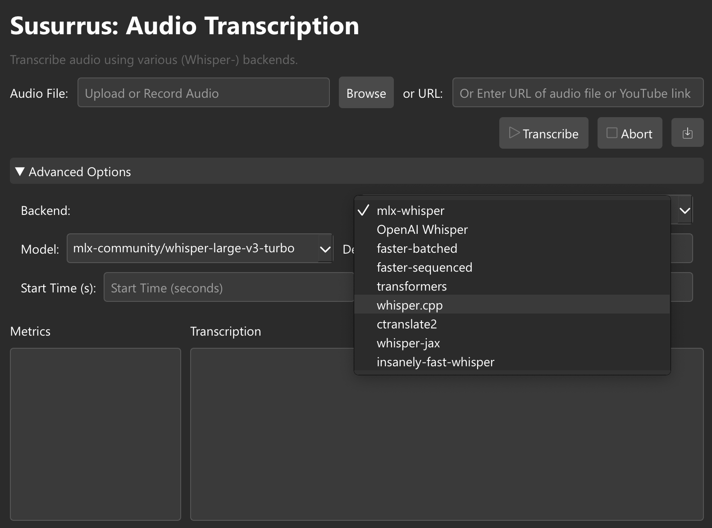

# Susurrus: Whisper Audio Transcription GUI

Susurrus is a flexible audio transcription frontend that leverages various AI models, mostly based on OpenAI Whisper, and backends to convert speech to text. It transcribes audio files, including online content, using a number of optional models and pipelines.

## Features

- Support for multiple transcription backends (mlx-whisper, OpenAI Whisper, faster-whisper, transformers, whisper.cpp, ctranslate2, whisper-jax, insanely-fast-whisper)
- Audio file upload and URL input support
- YouTube audio extraction and transcription
- Proxy support for network requests
- Language selection for targeted transcription
- Transcription metrics and progress tracking
- Graphical user interface
- Advanced options including start/end time for transcription, max chunk length, and output format selection for whisper.cpp (enabling subtitle export)
- Audio trimming functionality

## Screenshot



## Installation

### Prerequisites

- Python 3.8 or higher
- pip (Python package manager)
- Git
- C++ compiler (for whisper.cpp)
- CMake (for whisper.cpp)
- FFmpeg

### Common Steps (macOS, Linux, and Windows)

1. Clone the repository:
   ```
   git clone https://github.com/CrispStrobe/susurrus.git
   cd susurrus
   ```

2. Create and activate a virtual environment:
   - macOS/Linux:
     ```
     python3 -m venv venv
     source venv/bin/activate
     ```
   - Windows:
     ```
     python -m venv venv
     venv\Scripts\activate
     ```

3. Install the required packages:
   ```
   pip install -r requirements.txt
   ```

4. Install additional backend-specific packages:
   ```
   pip install openai-whisper faster-whisper transformers ctranslate2 whisper-jax soundfile insanely-fast-whisper
   ```

5. Install whisper.cpp:
   ```
   git clone https://github.com/ggerganov/whisper.cpp.git
   cd whisper.cpp
   mkdir build && cd build
   cmake ..
   cmake --build . --config Release
   cd ../..
   ```

or for windows:

   ```
   git clone https://github.com/ggerganov/whisper.cpp.git
   cd whisper.cpp
   mkdir build && cd build
   
   # Configure with UTF-8 support
   cmake -B . -DCMAKE_CXX_FLAGS="/utf-8" -DCMAKE_BUILD_TYPE=Release ..
   
   # Build
   cmake --build . --config Release
   cd ../..
   ```

[Rest of the content unchanged]

Note for Windows Users: The UTF-8 flag in the CMake configuration is important for proper handling of non-ASCII characters (like umlauts) in transcriptions.

6. Install FFmpeg:
   - macOS:
     ```
     brew install ffmpeg
     ```
   - Linux (Ubuntu/Debian):
     ```
     sudo apt-get update
     sudo apt-get install ffmpeg
     ```
   - Windows:
     - Download FFmpeg from [https://ffmpeg.org/download.html](https://ffmpeg.org/download.html)
     - Extract the downloaded archive and add the `bin` folder to your system PATH

### Additional Steps for Windows

- Ensure you have a C++ compiler installed. You can use Visual Studio with C++ support or MinGW-w64.
- Install CMake from [https://cmake.org/download/](https://cmake.org/download/) and add it to your system PATH.

## Usage

1. Activate the virtual environment (if not already activated):
   - macOS/Linux: `source venv/bin/activate`
   - Windows: `venv\Scripts\activate`

2. Run the main application:
   ```
   python susurrus.py
   ```

3. Use the graphical interface to:
   - Upload an audio file or provide a URL
   - Select the desired transcription backend and model
   - Configure advanced options if needed
   - Start the transcription process

4. View the transcription results and metrics in the application window

5. Save the transcription to a text file using the "Save" button

### Running the Transcription Worker Script

The transcription worker script can be run separately for debugging or advanced usage:

```
python transcribe_worker.py --audio-input <audio_file> --audio-url <url> --model-id <model_id> --word-timestamps --language <lang> --backend <backend> --device <device> --pipeline-type <type> --max-chunk-length <length> --output-format <format> --quantization <quant_type> --batch-size <size> --preprocessor-path <path> --original-model-id <orig_id> --start-time <start> --end-time <end>
```

Example:
```
python transcribe_worker.py --audio-input input.wav --model-id mlx-community/whisper-large-v3-mlx --word-timestamps --language en --backend mlx-whisper --device auto --pipeline-type default --start-time 10 --end-time 60
```

## Contributing

Contributions are welcome! Please feel free to submit a Pull Request.

## License

This project is licensed under the Apache 2.0 License. See the [LICENSE](LICENSE) file for details.

## Acknowledgements

- [OpenAI Whisper](https://github.com/openai/whisper)
- [MLX Community](https://github.com/ml-explore/mlx-examples)
- [Faster Whisper](https://github.com/guillaumekln/faster-whisper)
- [Transformers](https://github.com/huggingface/transformers)
- [whisper.cpp](https://github.com/ggerganov/whisper.cpp)
- [CTranslate2](https://github.com/OpenNMT/CTranslate2)
- [whisper-jax](https://github.com/sanchit-gandhi/whisper-jax)
- [yt-dlp](https://github.com/yt-dlp/yt-dlp)
- [Insanely Fast Whisper](https://github.com/Vaibhavs10/insanely-fast-whisper)
